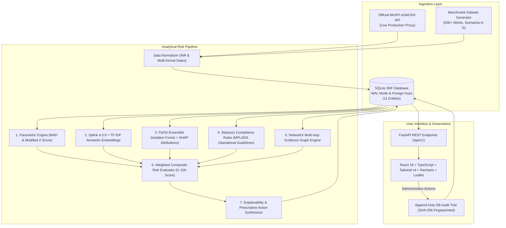

# NexSolve — MPLADS Risk Intelligence

[](https://mplads.mospi.gov.in)
[](https://sih.gov.in)
[](https://sansad.in)
[](./tests)
[](https://fastapi.tiangolo.com)
[](https://vite.dev)
[](./backend/audit)

> **IMPORTANT DISCLAIMER:**
> **DECISION-SUPPORT PROTOTYPE — NOT AN OFFICIAL MoSPI FINDING.**
> *This software is an administrative decision-support research prototype developed for SIH 2026 Problem Statement 26102. Risk indicators, entity resolution linkages, and anomaly scores are statistical suggestions intended to guide verification by competent administrative authorities and do not constitute legal or official findings of fraud.*

> **Official Problem Statement (ID: 26102):**
> *Development of an AI-powered system to detect anomalies, fraud, and inefficiencies in MPLAD Scheme implementation.*
> Sponsored by the **Ministry of Statistics and Programme Implementation (MoSPI) — Data Informatics & Innovation Division (DIID)**.

---

## 1. Executive Summary

The **NexSolve — MPLADS Risk Intelligence & Investigation Platform** is an explainable surveillance, entity resolution, and case management platform designed for MoSPI, State Nodal Authorities (SNAs), and District Authorities. It monitors developmental project execution across all 543 Lok Sabha and 245 Rajya Sabha constituencies, detecting expenditure anomalies, tender splitting, near-duplicates, chronic stalls, and contractor monopolization.

### Core Architectural Commitments:
1. **Explainable AI (XAI) as Core Differentiator:** Flagged projects provide an **Explainability Dossier** answering **"WHY was this project flagged?"**, featuring exact trigger factor attribution, comparative baseline distribution ($P_{25}$, $\text{Median}$, $P_{75}$, $P_{95}$, Observed pin), and prescriptive field verification checklists.
2. **Probabilistic Entity Resolution & Semantic Graph:** Integrates **Splink 4.0.9** (Fellegi-Sunter model over DuckDB execution backend) and deterministic TF-IDF semantic embeddings with a **NetworkX Evidence Graph** for multi-hop contractor and duplicate linkage.
3. **Strict False-Positive Safeguards:** Spatial proximity alone never triggers a high-risk relationship. As proven in the 801 ↔ 802 counterexample (166m apart, different sectors and contractors), the system returns `NO_SIGNIFICANT_RELATIONSHIP`.
4. **Strict Non-Accusatory Administrative Language:** All findings use neutral administrative terminology: *"anomaly"*, *"risk indicator"*, *"requires review"*, *"verification recommended"*.
5. **Truthful Audit & Security Transparency:** Relational append-only audit trail logging with SHA-256 data fingerprinting (no unverified blockchain claims). Security posture verified via Test 9.1 runner as `PASS_WITH_LIMITATIONS` (development baseline: no mock auth or fake enterprise claims).
6. **Dual-Data Transparency:** Transparent distinction between official live eSAKSHI data (`[OFFICIAL eSAKSHI]`) and synthetic validation test cases (`[BENCHMARK CASE]`).
7. **All 7 Anomaly Archetypes Validated:**
   - **Scenario A:** Tender Threshold Splitting (cluster just below ₹50 Lakhs limit).
   - **Scenario B:** Near-Duplicate Proximity (PCC road duplicate within 180m, >85% text similarity).
   - **Scenario C:** Severe Cost Outlier (+250% over district category median).
   - **Scenario D:** Advance Overpayment (85% disbursed with 10% progress).
   - **Scenario E:** Chronic Milestone Stall (420 days elapsed, 15% progress).
   - **Scenario F:** Contractor Monopolization (District HHI > 4,500, contractor share > 65%).
   - **Scenario G:** Statutory Trust/Society Cap Breach (> ₹1.00 Cr cumulative sanctions).

---

## 2. System Architecture



---

## 3. SIH 2026 Live Demo Script (5–7 Minutes)

| Time | Screen / Feature | Key Talking Points & Actions | Target Outcome |
| :--- | :--- | :--- | :--- |
| **0:00–1:00** | **Overview Dashboard** (`/`) | Highlight macro metrics: ₹12.5 Cr sanctioned, 500+ works monitored, 117 active risk signals (Score ≥ 30). Point out the KPI banners and click **"Review Risk Queue"** or the **"Inspect Work 101"** pill. | Establishes scale, parliamentary alignment, and executive visibility. |
| **1:00–2:30** | **Explainability Dossier (Hero)** (`/anomalies/WS/DEMO/2025/101/dossier`) | Showcase **Work 101** (PCC Road near-duplicate). Explain **What/Why/Evidence/Action**: Risk score 61, SHAP decomposition, benchmark distribution ($P_{25}$-Median-$P_{75}$-$P_{95}$ with observed pin), and prescriptive field checklist. | Proves NexSolve is NOT a black box; officers see exactly why it flagged. |
| **2:30–3:45** | **Evidence Graph & Entity Resolution** | Scroll to Evidence Graph component on Work 101 dossier. Show **101 ↔ 102** strong edge (Splink score 0.9997, TF-IDF 0.887, 180m distance -> `HIGH_SIMILARITY_REVIEW`). Inspect node attributes and linked contractors. | Demonstrates probabilistic record linkage (Splink 4.0.9) and graph intelligence. |
| **3:45–4:45** | **False-Positive Safeguard Counterexample** | Open **Work 801** (`WS/DEMO/2025/801`). Point out that Work 801 and Work 802 are only 166m apart, but Splink = 0, Semantic = 0, and sectors differ (Road vs School). System classifies relationship as `NO_SIGNIFICANT_RELATIONSHIP`. | Convinces technical judges that geospatial proximity alone does not cause false positives. |
| **4:45–5:30** | **Officer Workflow & Audit Trail** (`/investigations`, `/audit`) | Transition Work 101 to `UNDER_INVESTIGATION` or record officer findings. Show that actions require administrative remarks. Navigate to `/audit` to show the append-only log with SHA-256 fingerprinting. | Proves end-to-end governance, administrative accountability, and auditability. |

---

## 4. Repository Structure

```
mplads-risk-intelligence/
├── backend/                         # FastAPI Analytics & Risk Intelligence Service
│   ├── app/
│   │   ├── api/v1/                  # REST API Router & Endpoints
│   │   │   └── endpoints/           # Dashboard, Works, Anomalies, Dossier, Investigations, Geospatial, Audit
│   │   ├── core/config.py           # Thresholds, statutory caps, and model weights
│   │   ├── db/                      # SQLite engine (WAL mode) and demo dataset seeder
│   │   ├── models/entities.py       # 11 Relational 3NF Entities
│   │   ├── schemas/                 # Pydantic v2 DTOs (from_attributes = True)
│   │   ├── services/                # Hybrid Analytics Engines (Statistical, Splink, PyOD, Graph, XAI, Audit)
│   │   └── main.py                  # Application entry point with CORS & Lifespan
│   ├── audit/                       # Test 9.1 Forensic Security Hardening Runner
│   ├── requirements.txt             # Python dependencies
│   └── venv/                        # Virtual environment
├── frontend/                        # React 18 + TypeScript + Vite + Tailwind CSS v4
│   ├── src/
│   │   ├── components/              # Modular UI components (GovHeader, StatCard, RiskBadge, EvidenceGraph)
│   │   │   └── explainability/      # ExplainabilityDossier, BaselineBarChart, DuplicateComparison, VerificationChecklist
│   │   ├── pages/                   # OverviewDashboard, RiskExplorer, GeoSpatialView, InvestigationQueue, AuditTrailView
│   │   ├── services/                # Axios API client & TypeScript interfaces
│   │   └── App.tsx                  # Master navigation & application state
│   ├── package.json                 # Node dependencies & scripts
│   └── vite.config.ts               # Vite bundler configuration & backend API proxy
├── data/                            # Database storage & dataset directories
│   ├── mplads.db                    # Active SQLite database (WAL mode)
│   ├── raw/                         # Raw eSAKSHI ingestion dumps
│   └── synthetic/                   # Benchmark anomaly archetypes
├── docs/                            # Comprehensive Architectural & Verification Specifications
├── tests/                           # 52 Automated backend tests (Unit, Analytics, Security, Graph, Splink)
├── Makefile                         # Unified command-line interface
└── README.md                        # Project documentation (this file)
```

---

## 5. Quick Start Guide

### Prerequisites
- macOS or Linux
- Python 3.11+
- Node.js 18+ and npm

### One-Command Operations (via Makefile)
```bash
# 1. Run all 52 automated tests
make test

# 2. Build frontend production bundle & compile backend
make build

# 3. Start Backend API Server (http://localhost:8000)
make backend

# 4. Start Frontend Application (http://localhost:5173)
make frontend
```

### Direct Script Execution
```bash
# Run pytest test suite (52 tests)
PYTHONPATH=backend backend/venv/bin/pytest tests/backend -v

# Run Test 9.1 Forensic Security Runner
PYTHONPATH=backend backend/venv/bin/python backend/audit/test_9_1_forensic_runner.py

# Verify frontend build
npm --prefix frontend run build
```

---

## 6. Live Services & Endpoints

- **Web Application:** `http://localhost:5173`
- **Backend API:** `http://localhost:8000`
- **Interactive OpenAPI Documentation:** `http://localhost:8000/docs`
- **Health Check:** `http://localhost:8000/health`

---

## 7. Testing, Security & Quality Assurance

Automated test suite validates 100% of analytical engines, security boundaries, and benchmark cases across **52 passing tests**:

| Test Group | Test File | Test Count | Status | Key Coverage |
| :--- | :--- | :---: | :---: | :--- |
| **API Endpoints** | `test_api_endpoints.py` | 13 | **PASSED** | Dossier contract, lifecycle transitions, queue pagination |
| **Analytics Engine** | `test_analytics.py` | 16 | **PASSED** | Scenarios A-G, false discovery, macro metrics |
| **Risk Scoring** | `test_risk_engine.py` | 13 | **PASSED** | Benchmark scores (001, 101, 102, 401, 501), weight validation |
| **Executive Analytics** | `test_executive_analytics_reconciliation.py` | 1 | **PASSED** | Cross-endpoint metric reconciliation |
| **Security & Hardening** | `test_security_adversarial.py` | 5 | **PASSED** | SQLi resistance, XSS escaping, score immutability |
| **Entity Resolution** | `test_phase2_entity_resolution.py` | 1 | **PASSED** | Splink Fellegi-Sunter & TF-IDF similarity |
| **Evidence Graph** | `test_phase3_evidence_graph.py` | 4 | **PASSED** | Multi-hop graph, 801/802 counterexample, determinism |
| **Dynamic Security** | `test_9_1_forensic_runner.py` | 16 Probes | **PASS_WITH_LIMITATIONS** | Verified clean injection/traversal; auth/CORS documented |

---

## 7. Official Documentation Library

All architectural specifications are organized in the [`docs/`](./docs) directory:
- [Product Requirements Document (PRD)](./docs/specifications/01_PRD.md)
- [Monorepo Architecture Specification](./docs/architecture/02_ARCHITECTURE_SPEC.md)
- [Relational Database Schema (3NF)](./docs/architecture/03_DATABASE_SCHEMA.md)
- [OpenAPI 3.1 REST Specification](./docs/specifications/04_API_SPECIFICATION.md)
- [Hybrid Multi-Engine Analytics Methodology](./docs/specifications/05_ANALYTICS_METHODOLOGY.md)
- [UI Information Architecture & Design System](./docs/architecture/06_UI_INFORMATION_ARCHITECTURE.md)
- [eSAKSHI Schema & Anomaly Benchmark Dataset Specification](./docs/specifications/07_DEMO_DATASET_SPECIFICATION.md)
- [4-Tier QA Test Strategy](./docs/testing/08_TEST_STRATEGY.md)
- [48-Hour MVP Sprint Plan](./docs/planning/09_2DAY_MVP_PLAN.md)
- [3-Day Stretch Goals Roadmap](./docs/planning/10_3DAY_STRETCH_PLAN.md)

---

## 8. License & Attribution

Developed for the **Smart India Hackathon 2026**.
In compliance with the **MPLADS Scheme Guidelines (2023 Revision)** published by the Ministry of Statistics and Programme Implementation (MoSPI), Government of India.
