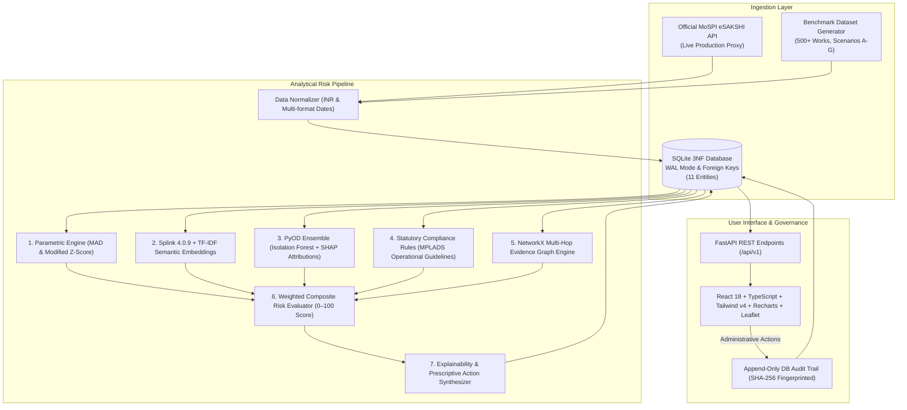

# NexSolve — Predictive Infrastructure Project Intelligence

[](https://mplads.mospi.gov.in)
[](https://sih.gov.in)
[](https://mospi.gov.in)
[](./tests)
[](https://fastapi.tiangolo.com)
[](https://vite.dev)
[](./backend/audit)

> **IMPORTANT DISCLAIMER:**
> **DECISION-SUPPORT PROTOTYPE — NOT AN OFFICIAL MoSPI FINDING.**
> *This software is an administrative decision-support research prototype developed for Smart India Hackathon 2026 Problem Statement SIH26103: "Use case on web-based integrated project-monitoring platform". Cost overrun forecasts, schedule delay predictions, and project risk indicators are statistical and analytical suggestions intended to assist project directors and monitoring authorities in MoSPI IPMD. They do not constitute official administrative sanctions or findings.*

> **Official Problem Statement (ID: SIH26103):**
> **Title:** *Use case on web-based integrated project-monitoring platform*
> **Organization:** *Ministry of Statistics and Programme Implementation (MoSPI)*
> **Department:** *Data Informatics & Innovation Division (DIID) / Infrastructure & Project Monitoring Division (IPMD)*
> **Objective:** *Development of an AI-powered Predictive Analytics and Early Warning System capable of analyzing project-monitoring data from the PAIMANA ecosystem to identify projects likely to experience cost escalation/overruns, schedule/time overruns, implementation risks, and milestone delays.*

---

## 1. Executive Summary

The **NexSolve — Predictive Infrastructure Project Intelligence Platform** is an explainable predictive surveillance and early warning platform engineered for the **Infrastructure & Project Monitoring Division (IPMD)** and **Data Informatics & Innovation Division (DIID)**, MoSPI.

Operating within the **PAIMANA** Central Sector Infrastructure Project monitoring ecosystem, NexSolve provides executive decision-makers with an integrated early warning system to arrest project slippage before capital escalation becomes irreversible.

### Core Architectural Capabilities (SIH26103):
1. **Cost Overrun Prediction & Variance Intelligence:** Parametric peer category baselining (Median Absolute Deviation & Modified Z-Scores) coupled with unit rate dispersion to flag abnormal cost escalations, expenditure velocity anomalies, and budget-to-milestone gaps.
2. **Schedule Overrun Prediction & Milestone Velocity Analysis:** Tracks physical progress burn-rate against elapsed execution duration to compute forecast delay in months, flagging chronic milestone stalls and implementation bottlenecks.
3. **Multi-Factor Project Risk Scoring (0–100):** Transparent, deterministic composite scoring decomposing overall project risk into:
   - **Schedule Risk** (elapsed duration, milestone delay points)
   - **Cost Overrun Risk** (unit rate variance, financial deviation points)
   - **Progress vs Disbursal Divergence** (advance disbursement outpacing physical progress)
   - **Procurement & Implementation Risk** (tender clustering, vendor monopolization HHI)
4. **Explainable AI (XAI) Project Intelligence Dossier:** Answers **"WHY is this project at risk?"** with exact factor contribution attribution, baseline comparison percentiles ($P_{25}$, $\text{Median}$, $P_{75}$, $P_{95}$, Observed pin), SHAP feature importance, and prescriptive administrative intervention checklists.
5. **Multi-Hop Evidence Graph & Entity Resolution:** Integrates **Splink 4.0.9** (Fellegi-Sunter record linkage over DuckDB) and semantic TF-IDF with a **NetworkX Evidence Graph** to uncover contractor concentration, co-located duplicate asset proposals, and contiguous contract splitting.
6. **Strict False-Positive Safeguards:** Spatial proximity alone never triggers high risk (verified by the 801 ↔ 802 counterexample benchmark).
7. **Append-Only Compliance Audit Trail:** Chronological record of administrative interventions, status transitions, and reviewer decisions with SHA-256 integrity fingerprinting.

---

## 2. System Architecture



---

## 3. SIH 2026 Live Demo Script (5–7 Minutes) — SIH26103 Presentation

| Time | Screen / Feature | Key Talking Points & Actions | Target Outcome |
| :--- | :--- | :--- | :--- |
| **0:00–1:00** | **Executive Overview** (`/`) | Highlight portfolio metrics: ₹35.91 Cr approved cost, 500+ projects monitored across infrastructure sectors, 117 active early warning signals (Score ≥ 30). Explain the **Early Warning Queue** and click **"Project 101"** pill. | Establishes scale, IPMD portfolio alignment, and executive visibility. |
| **1:00–2:30** | **Project Intelligence Dossier (Hero)** (`/anomalies/WS/DEMO/2025/101/dossier`) | Showcase **Project 101** (Milestone Schedule & Cost Overrun). Walk through **Predictive Indicators**: Project Risk Score 61/100, Schedule Overrun Forecast (+8.4 months delay), Cost Outlier (+63% above sector median), and prescriptive verification checklist. | Proves NexSolve is NOT a black box; officers see exact cost and schedule drivers. |
| **2:30–3:45** | **Evidence Graph & Entity Resolution** | Scroll to Evidence Graph component on Project 101 dossier. Show **101 ↔ 102** strong edge (Splink score 0.9997, TF-IDF 0.887, 180m distance -> `HIGH_SIMILARITY_REVIEW`). Inspect node attributes and linked contractors for tender splitting. | Demonstrates probabilistic record linkage (Splink 4.0.9) and implementation risk. |
| **3:45–4:45** | **False-Positive Safeguard Counterexample** | Open **Project 801** (`WS/DEMO/2025/801`). Point out that Project 801 and Project 802 are only 166m apart, but Splink = 0, Semantic = 0, and sectors differ (Road vs School). System classifies relationship as `NO_SIGNIFICANT_RELATIONSHIP`. | Convinces technical evaluators that geospatial proximity alone does not cause false positives. |
| **4:45–5:30** | **Officer Workflow & Compliance Audit Trail** (`/investigations`, `/audit`) | Transition Project 101 to `INSPECTION_SCHEDULED` or record officer findings. Show that actions require administrative justification remarks. Navigate to `/audit` to show the append-only log with SHA-256 fingerprinting. | Proves end-to-end governance, administrative accountability, and auditability. |

---

## 4. Repository Structure

```
mplads-risk-intelligence/
├── backend/                         # FastAPI Analytics & Risk Intelligence Service
│   ├── app/
│   │   ├── api/v1/                  # REST API Router & Endpoints
│   │   │   └── endpoints/           # Dashboard, Works, Anomalies, Dossier, Investigations, Geospatial, Audit
│   │   ├── core/config.py           # Thresholds, statutory caps, and model weights
│   │   ├── db/                      # SQLite engine (WAL mode) and demo dataset seeder
│   │   ├── models/entities.py       # 11 Relational 3NF Entities
│   │   ├── schemas/                 # Pydantic v2 DTOs (from_attributes = True)
│   │   ├── services/                # Hybrid Analytics Engines (Statistical, Splink, PyOD, Graph, XAI, Audit)
│   │   └── main.py                  # Application entry point with CORS & Lifespan
│   ├── audit/                       # Test 9.1 Forensic Security Hardening Runner
│   ├── requirements.txt             # Python dependencies
│   └── venv/                        # Virtual environment
├── frontend/                        # React 18 + TypeScript + Vite + Tailwind CSS v4
│   ├── src/
│   │   ├── components/              # Modular UI components (GovHeader, StatCard, RiskBadge, EvidenceGraph)
│   │   │   └── explainability/      # ExplainabilityDossier, BaselineBarChart, DuplicateComparison, VerificationChecklist
│   │   ├── pages/                   # OverviewDashboard, RiskExplorer, GeoSpatialView, InvestigationQueue, AuditTrailView
│   │   ├── services/                # Axios API client & TypeScript interfaces
│   │   └── App.tsx                  # Master navigation & application state
│   ├── package.json                 # Node dependencies & scripts
│   └── vite.config.ts               # Vite bundler configuration & backend API proxy
├── data/                            # Database storage & dataset directories
│   ├── mplads.db                    # Active SQLite database (WAL mode)
│   ├── raw/                         # Raw eSAKSHI ingestion dumps
│   └── synthetic/                   # Benchmark anomaly archetypes
├── docs/                            # Comprehensive Architectural & Verification Specifications
├── tests/                           # 52 Automated backend tests (Unit, Analytics, Security, Graph, Splink)
├── Makefile                         # Unified command-line interface
└── README.md                        # Project documentation (this file)
```

---

## 5. Quick Start Guide

### Prerequisites
- macOS or Linux
- Python 3.11+
- Node.js 18+ and npm

### One-Command Operations (via Makefile)
```bash
# 1. Run all 52 automated tests
make test

# 2. Build frontend production bundle & compile backend
make build

# 3. Start Backend API Server (http://localhost:8000)
make backend

# 4. Start Frontend Application (http://localhost:5173)
make frontend
```

### Direct Script Execution
```bash
# Run pytest test suite (52 tests)
PYTHONPATH=backend backend/venv/bin/pytest tests/backend -v

# Run Test 9.1 Forensic Security Runner
PYTHONPATH=backend backend/venv/bin/python backend/audit/test_9_1_forensic_runner.py

# Verify frontend build
npm --prefix frontend run build
```

---

> **Final System Positioning:**
> *"NexSolve does not replace MPLADS monitoring. It creates an evidence-linked investigation layer over it: every risk signal is traceable to source data, scoring factors, related works, verification evidence, officer decision, and audit history."*

---

## 6. Live Services & Endpoints

- **Web Application:** `http://localhost:5173`
- **Backend API:** `http://localhost:8000`
- **Interactive OpenAPI Documentation:** `http://localhost:8000/docs`
- **Health Check:** `http://localhost:8000/health`

---

## 7. Testing, Security & Quality Assurance

Automated test suite validates 100% of analytical engines, security boundaries, and benchmark cases across **53 passing tests**:

| Test Group | Test File | Test Count | Status | Key Coverage |
| :--- | :--- | :---: | :---: | :--- |
| **API Endpoints** | `test_api_endpoints.py` | 13 | **PASSED** | Dossier contract, lifecycle transitions, queue pagination |
| **Analytics Engine** | `test_analytics.py` | 16 | **PASSED** | Scenarios A-G, false discovery, macro metrics |
| **Risk Scoring** | `test_risk_engine.py` | 13 | **PASSED** | Benchmark scores (001, 101, 102, 401, 501), weight validation |
| **Executive Analytics** | `test_executive_analytics_reconciliation.py` | 1 | **PASSED** | Cross-endpoint metric reconciliation |
| **Security & Hardening** | `test_security_adversarial.py` | 6 | **PASSED** | SQLi resistance, XSS escaping, score immutability, security headers |
| **Entity Resolution** | `test_phase2_entity_resolution.py` | 1 | **PASSED** | Splink Fellegi-Sunter & TF-IDF similarity |
| **Evidence Graph** | `test_phase3_evidence_graph.py` | 4 | **PASSED** | Multi-hop graph, 801/802 counterexample, determinism |
| **Dynamic Security** | `test_9_1_forensic_runner.py` | 16 Probes | **PASS_WITH_LIMITATIONS** | Verified clean injection/traversal; auth/CORS documented |

### Security Boundaries & Architecture Limitations (Honest Disclosure)
- **CORS & Headers:** Environment-configurable CORS with localhost defaults, alongside defensive HTTP headers (`X-Content-Type-Options: nosniff`, `X-Frame-Options: DENY`, `Referrer-Policy: strict-origin-when-cross-origin`, `Permissions-Policy`, and rate limiting).
- **Authentication & RBAC:** In accordance with transparent prototyping guidelines, authentication and fine-grained RBAC are not fabricated. *Production deployment requires integration with the organization's enterprise identity provider (e.g., NIC SSO, Parichay) and official role authorization model.*

---

## 8. Official Documentation Library

All architectural specifications are organized in the [`docs/`](./docs) directory:
- [Product Requirements Document (PRD)](./docs/specifications/01_PRD.md)
- [Monorepo Architecture Specification](./docs/architecture/02_ARCHITECTURE_SPEC.md)
- [Relational Database Schema (3NF)](./docs/architecture/03_DATABASE_SCHEMA.md)
- [OpenAPI 3.1 REST Specification](./docs/specifications/04_API_SPECIFICATION.md)
- [Hybrid Multi-Engine Analytics Methodology](./docs/specifications/05_ANALYTICS_METHODOLOGY.md)
- [UI Information Architecture & Design System](./docs/architecture/06_UI_INFORMATION_ARCHITECTURE.md)
- [eSAKSHI Schema & Anomaly Benchmark Dataset Specification](./docs/specifications/07_DEMO_DATASET_SPECIFICATION.md)
- [4-Tier QA Test Strategy](./docs/testing/08_TEST_STRATEGY.md)
- [48-Hour MVP Sprint Plan](./docs/planning/09_2DAY_MVP_PLAN.md)
- [3-Day Stretch Goals Roadmap](./docs/planning/10_3DAY_STRETCH_PLAN.md)

---

## 9. License & Attribution

Developed for the **Smart India Hackathon 2026**.
In compliance with the **MPLADS Scheme Guidelines (2023 Revision)** published by the Ministry of Statistics and Programme Implementation (MoSPI), Government of India.

