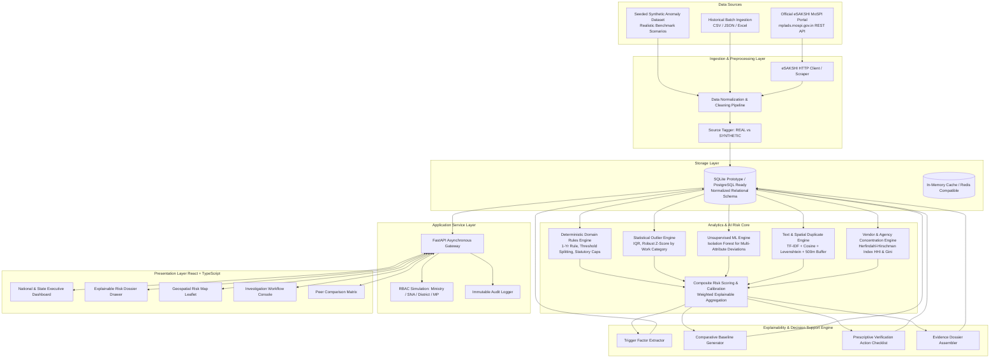

# System Architecture Specification

## Project Details
- **Problem Statement ID:** 26102
- **Title:** Development of an AI-powered system to detect anomalies, fraud, and inefficiencies in MPLAD Scheme implementation
- **Platform:** MPLADS Risk Intelligence & Investigation Platform (RIIP)
- **Target Audience:** MoSPI DIID, State Nodal Authorities, District Collectors, MP Reviewers

---

## 1. Monorepo Structure

```
mplads-risk-intelligence/
├── backend/
│   ├── app/
│   │   ├── api/
│   │   │   ├── v1/
│   │   │   │   ├── endpoints/
│   │   │   │   │   ├── dashboard.py       # Macro aggregations & KPI tiles
│   │   │   │   │   ├── works.py           # Work/project exploration & filtering
│   │   │   │   │   ├── anomalies.py       # Flagged risk items & explainability dossiers
│   │   │   │   │   ├── investigations.py  # Review workflows, status updates, notes
│   │   │   │   │   ├── geospatial.py      # Spatial clustering & GeoJSON feeds
│   │   │   │   │   ├── esakshi_proxy.py   # Live MoSPI eSAKSHI data proxy & sync
│   │   │   │   │   └── audit.py           # Immutable audit log queries
│   │   │   │   └── router.py
│   │   ├── core/
│   │   │   ├── config.py                  # Environment settings, thresholds
│   │   │   ├── logging.py                 # Structured audit & debug logging
│   │   │   └── security.py                # RBAC simulation & headers
│   │   ├── db/
│   │   │   ├── session.py                 # SQLAlchemy SQLite / Postgres engine
│   │   │   ├── base.py                    # Base declarative models
│   │   │   └── init_db.py                 # Schema bootstrapper & seeder
│   │   ├── models/                        # SQLAlchemy ORM definitions
│   │   │   ├── geography.py               # State, District (IDA/NDA), Constituency
│   │   │   ├── parliament.py              # MP profile, House, Tenure
│   │   │   ├── work.py                    # Work recommendation, Sanction, Progress
│   │   │   ├── finance.py                 # Vendor, Expenditure disbursement
│   │   │   ├── risk.py                    # Risk indicators, Anomaly scores, Trigger factors
│   │   │   └── investigation.py           # Review records, Action logs, Audit entries
│   │   ├── schemas/                       # Pydantic v2 validation & response DTOs
│   │   │   ├── work_dto.py
│   │   │   ├── risk_dto.py
│   │   │   ├── investigation_dto.py
│   │   │   └── dashboard_dto.py
│   │   ├── services/                      # Business & Risk Logic Services
│   │   │   ├── esakshi_client.py          # Real MoSPI eSAKSHI REST scraper/client
│   │   │   ├── data_normalizer.py         # Currency parsing, date parsing, cleansing
│   │   │   ├── risk_engine.py             # Composite Risk Orchestrator
│   │   │   ├── statistical_engine.py      # Z-score, IQR, Modified Z-score, Baselines
│   │   │   ├── ml_engine.py               # Isolation Forest & Unsupervised clustering
│   │   │   ├── similarity_engine.py       # TF-IDF Cosine Similarity & Levenshtein
│   │   │   ├── explainability_service.py  # Plain-English Rationale & Verification Advice
│   │   │   └── audit_service.py           # Tamper-evident action logging
│   │   └── main.py                        # FastAPI Application entrypoint
│   ├── requirements.txt
│   └── Dockerfile
├── frontend/
│   ├── src/
│   │   ├── assets/                        # Logos, icons, map styling
│   │   ├── components/
│   │   │   ├── ui/                        # shadcn/ui primitives (Button, Modal, Card, Table)
│   │   │   ├── layout/                    # Header, GovBar, Sidebar, ModeBanner
│   │   │   ├── dashboard/                 # KPI Cards, Trend Line, SABHA switcher
│   │   │   ├── explainability/            # XAI Breakdown Drawer, Factor Chips, Baseline Bar
│   │   │   ├── investigation/             # Review Modal, Action Stepper, Audit Timeline
│   │   │   ├── map/                       # Leaflet / MapLibre Risk Heatmap & Co-location Circles
│   │   │   └── common/                    # Data Source Badge (Real vs Demo), Severity Badge
│   │   ├── pages/
│   │   │   ├── OverviewDashboard.tsx      # MoSPI Central Command
│   │   │   ├── RiskExplorer.tsx           # Anomaly Grid with Multi-Filter
│   │   │   ├── ProjectDossier.tsx         # Detailed Work View + XAI Dossier
│   │   │   ├── InvestigationQueue.tsx     # Reviewer Workflow Kanban & Table
│   │   │   ├── GeoSpatialView.tsx         # Geographic Anomaly Map
│   │   │   └── PeerBenchmarking.tsx       # Constituency & Agency comparative analysis
│   │   ├── services/
│   │   │   ├── api.ts                     # Axios client + React Query hooks
│   │   │   └── types.ts                   # TypeScript interfaces matching Pydantic DTOs
│   │   ├── App.tsx
│   │   └── main.tsx
│   ├── package.json
│   ├── tailwind.config.js
│   ├── vite.config.ts
│   └── Dockerfile
├── data/
│   ├── raw/                               # Ingested eSAKSHI raw JSON responses
│   ├── synthetic/                         # Seeded synthetic benchmark cases
│   └── demo_db.sqlite                     # Pre-indexed SQLite database
├── docs/                                  # Specifications & Architectural Documentation
└── tests/
    ├── backend/
    │   ├── test_risk_engine.py
    │   ├── test_similarity.py
    │   ├── test_api_endpoints.py
    │   └── test_explainability.py
    └── frontend/
        └── test_dashboard_render.ts
```

---

## 2. High-Level Architecture Diagram



---

## 3. Component Architecture & Interactions

### 3.1 Data Ingestion & Proxy Layer (`services/esakshi_client.py`)
- Employs resilient asynchronous HTTP clients (`httpx`) to query eSAKSHI endpoints.
- Supports incremental syncs using state/constituency combinations (`comboData`).
- Maintains automatic retry policies with exponential backoff and rate-limiting safeguards.
- Tags every ingested record with `is_synthetic = False` and captures source timestamp.

### 3.2 Feature Engineering & Baseline Engine
Before anomalies are detected, the system pre-computes comparative baselines per category and geographic slice:
- `category_median_cost`: Median sanctioned amount per meter/sq.ft for each activity type (e.g. PCC roads, community halls, solar high-mast lights).
- `district_completion_velocity`: Mean days taken by Implementing Agencies in that district from sanction to completion.
- `agency_vendor_entropy`: Shannon entropy measuring diversity of vendor allocations per IA.

### 3.3 The Explainable AI (XAI) Pipeline
Unlike black-box neural networks, our hybrid model guarantees complete provenance:
1. **Rule Evaluation:** If a deterministic violation occurs (e.g., sanction age > 365 days and progress < 10%), a rule penalty is assigned.
2. **Statistical Metric:** Calculates the distance from the category distribution:
   $$Z_{\text{mod}} = \frac{0.6745 \times (x - \tilde{x})}{\text{MAD}}$$
3. **ML Signal:** Isolation Forest assigns an anomaly score $s \in [-1, 1]$ based on multivariate isolation depth across `[estimated_cost, disbursement_ratio, elapsed_time_ratio]`.
4. **Composite Score:** Combines calibrated sub-scores into an explainable index $\in [0, 100]$:
   $$\text{Composite Risk} = \sum w_i \cdot s_i$$
5. **Attribution Decomposition:** Returns the exact percentage contribution of each feature to the composite score.

### 3.4 Investigation Workflow & Audit Logging
- State machine governs investigation transitions:
  `FLAGGED -> UNDER_INVESTIGATION -> INFO_REQUESTED -> INSPECTION_SCHEDULED -> RESOLVED_EXPLAINED / ESCALATED_AUDIT`.
- Every transition commits an entry to `audit_logs` containing `actor_id`, `previous_state`, `new_state`, `rationale_note`, `ip_address`, and `timestamp`.

---

## 4. Frontend Technology Stack & Patterns

- **Framework:** React 18 + TypeScript + Vite for instant hot-reload and optimized production bundling.
- **Styling:** Tailwind CSS with a government-grade neutral palette (Navy `#0d2b45`, Emerald `#1a936f`, Amber `#f59e0b`, Crimson `#dc2626`).
- **Component Library:** shadcn/ui (Radix UI accessible primitives: Dialogs, Popovers, Accordions, DataTables).
- **Visualization:** Recharts for baseline distributions, bar charts, and timeline velocities; Leaflet / React-Leaflet for interactive constituency maps with custom SVG markers.
- **State & Data Fetching:** TanStack React Query v5 for server-state caching, background revalidation, and optimistic updates.
- **Icons:** Lucide-React for crisp, uniform iconography.

---

## 5. Security, Resilience & Scalability Considerations

1. **Database Decoupling:** Uses SQLAlchemy ORM. The prototype operates on a high-concurrency WAL-mode SQLite database (`journal_mode=WAL`), allowing seamless transition to PostgreSQL with a single connection string change (`postgresql+psycopg2://...`).
2. **Graceful Offline Mode:** Includes bundled real eSAKSHI data snapshots alongside seeded synthetic cases so the platform remains 100% interactive and demonstrable even without active internet access.
3. **Audit Immutability:** Audit tables are append-only. No `UPDATE` or `DELETE` operations are permitted on audit rows.
