# Database Schema Specification

## Project Details
- **Problem Statement ID:** 26102
- **Title:** Development of an AI-powered system to detect anomalies, fraud, and inefficiencies in MPLAD Scheme implementation
- **Platform:** MPLADS Risk Intelligence & Investigation Platform (RIIP)

---

## 1. Overview & Portability Strategy

The database schema is engineered in 3NF (Third Normal Form) to faithfully mirror the operational entities of the MoSPI **eSAKSHI** portal while providing robust storage for risk indicators, feature vectors, investigation workflows, and tamper-evident audit logs.

### Dual-Database Compatibility (SQLite & PostgreSQL)
- **Prototype Engine:** High-performance SQLite 3 with Write-Ahead Logging (`WAL` mode) enabled for rapid local execution and hackathon demonstration.
- **Enterprise Target:** Designed to seamlessly migrate to PostgreSQL 15+ without code modifications by utilizing:
  - SQLAlchemy standard data types (`String`, `Integer`, `Float`, `DateTime`, `Boolean`, `Text`).
  - Native `JSON` type (mapped to `TEXT` with JSON serialization in SQLite, and `JSONB` in PostgreSQL).
  - Explicit foreign keys, unique constraints, and indexes.

---

## 2. Entity-Relationship Diagram (ERD)

```mermaid
erDiagram
    STATES ||--o{ DISTRICTS : contains
    STATES ||--o{ CONSTITUENCIES : contains
    CONSTITUENCIES ||--o{ MEMBERS_OF_PARLIAMENT : represented_by
    DISTRICTS ||--o{ IMPLEMENTING_AGENCIES : supervises
    DISTRICTS ||--o{ WORKS : executes_in
    MEMBERS_OF_PARLIAMENT ||--o{ WORKS : recommends
    IMPLEMENTING_AGENCIES ||--o{ WORKS : implements
    WORKS ||--o{ EXPENDITURES : disburses
    VENDORS ||--o{ EXPENDITURES : receives
    WORKS ||--o| RISK_ANOMALIES : evaluated_for
    RISK_ANOMALIES ||--o| INVESTIGATIONS : reviewed_in
    INVESTIGATIONS ||--o{ AUDIT_LOGS : logged_in

    STATES {
        int state_id PK
        string state_name
        string state_code
    }

    DISTRICTS {
        int district_id PK
        string district_name
        string ida_code
        int state_id FK
    }

    CONSTITUENCIES {
        int constituency_id PK
        string constituency_name
        string house_type
        int state_id FK
    }

    MEMBERS_OF_PARLIAMENT {
        int mp_id PK
        string mp_name
        string house
        int constituency_id FK
        string tenure
        date tenure_start_date
        date tenure_end_date
        float allocated_limit
    }

    IMPLEMENTING_AGENCIES {
        int ia_id PK
        string ia_name
        string agency_type
        int district_id FK
    }

    VENDORS {
        int vendor_id PK
        string vendor_name
        string registration_no
        string pan_hash
    }

    WORKS {
        string work_id PK
        int work_recommendation_dtl_id
        string activity_name
        string work_category
        text work_description
        int mp_id FK
        int constituency_id FK
        int district_id FK
        int ia_id FK
        string location_type
        string block_name
        string village_name
        float latitude
        float longitude
        string letter_no
        date recommendation_date
        date sanction_date
        date actual_end_date
        float sanctioned_amount
        float estimated_cost
        float physical_progress_pct
        string work_status
        string file_status
        boolean is_synthetic
        datetime created_at
    }

    EXPENDITURES {
        int expenditure_id PK
        string work_id FK
        int vendor_id FK
        date expenditure_date
        float fund_disbursed_amt
        string payment_status
        string voucher_no
        boolean is_synthetic
    }

    RISK_ANOMALIES {
        int anomaly_id PK
        string work_id FK
        float composite_risk_score
        string severity_level
        float confidence_score
        string status
        json rule_triggers
        json baseline_metrics
        text explainability_narrative
        json recommended_actions
        datetime created_at
    }

    INVESTIGATIONS {
        int investigation_id PK
        int anomaly_id FK
        string work_id FK
        string status
        string assigned_role
        text reviewer_notes
        string outcome_decision
        datetime updated_at
    }

    AUDIT_LOGS {
        int audit_id PK
        string entity_type
        string entity_id
        string action_type
        json old_value
        json new_value
        string actor_role
        string ip_address
        datetime timestamp
    }
```



---

## 3. Data Dictionary & Table Definitions

### 3.1 `states`
Master table of Indian States and Union Territories (matching eSAKSHI `STATE_ID` and `STATE_NAME`).
| Column | Type | Constraints | Description |
| :--- | :--- | :--- | :--- |
| `state_id` | INTEGER | PRIMARY KEY | MoSPI State ID (e.g., 35 for Andaman, 6 for Bihar) |
| `state_name` | VARCHAR(100) | NOT NULL, UNIQUE | State or UT name |
| `state_code` | VARCHAR(10) | NULLABLE | Standard Census/ISO code |

### 3.2 `districts`
Implementing District Authorities (IDA) and Nodal District Authorities (NDA).
| Column | Type | Constraints | Description |
| :--- | :--- | :--- | :--- |
| `district_id` | INTEGER | PRIMARY KEY AUTOINCREMENT | Unique surrogate identifier |
| `district_name`| VARCHAR(150) | NOT NULL | Official district name |
| `ida_code` | VARCHAR(150) | NOT NULL | eSAKSHI IDA Designation string |
| `state_id` | INTEGER | FOREIGN KEY (`states.state_id`) | State reference |

### 3.3 `constituencies`
Parliamentary Constituencies for Lok Sabha and Rajya Sabha jurisdictions.
| Column | Type | Constraints | Description |
| :--- | :--- | :--- | :--- |
| `constituency_id` | INTEGER | PRIMARY KEY | eSAKSHI `CONSTITUENCY_ID` |
| `constituency_name`| VARCHAR(150) | NOT NULL | Name of constituency |
| `house_type` | VARCHAR(20) | NOT NULL | `LOK_SABHA` or `RAJYA_SABHA` |
| `state_id` | INTEGER | FOREIGN KEY (`states.state_id`) | Parent State reference |

### 3.4 `members_of_parliament`
Details of Hon'ble MPs, allocation entitlements, and active tenure.
| Column | Type | Constraints | Description |
| :--- | :--- | :--- | :--- |
| `mp_id` | INTEGER | PRIMARY KEY AUTOINCREMENT | Internal MP Identifier |
| `mp_name` | VARCHAR(150) | NOT NULL | Full name of Member of Parliament |
| `house` | VARCHAR(20) | NOT NULL | `LOK` or `RAJYA` |
| `constituency_id` | INTEGER | FOREIGN KEY (`constituencies.constituency_id`) | NULL for nominated Rajya Sabha |
| `tenure` | VARCHAR(50) | NOT NULL | e.g. "18th Lok Sabha", "2022-2028" |
| `tenure_start_date`| DATE | NULLABLE | Beginning of tenure |
| `tenure_end_date` | DATE | NULLABLE | Scheduled end of tenure |
| `allocated_limit` | NUMERIC(15,2)| DEFAULT 0.00 | Total authorized ceiling limit (₹) |

### 3.5 `implementing_agencies`
Agencies tasked by District Authorities with work execution (e.g. APWD, DRDA, Municipal Corp).
| Column | Type | Constraints | Description |
| :--- | :--- | :--- | :--- |
| `ia_id` | INTEGER | PRIMARY KEY AUTOINCREMENT | Surrogate Agency ID |
| `ia_name` | VARCHAR(200) | NOT NULL | Name/Designation of IA |
| `agency_type` | VARCHAR(100) | NULLABLE | Public Works, Rural Dev, Education, etc. |
| `district_id` | INTEGER | FOREIGN KEY (`districts.district_id`) | Supervising District |

### 3.6 `vendors`
Contractors and commercial entities executing works and receiving payments.
| Column | Type | Constraints | Description |
| :--- | :--- | :--- | :--- |
| `vendor_id` | INTEGER | PRIMARY KEY | eSAKSHI Vendor ID |
| `vendor_name` | VARCHAR(250) | NOT NULL | Legal name of vendor/contractor |
| `registration_no`| VARCHAR(100) | NULLABLE | Vendor registration/GSTIN reference |
| `pan_hash` | VARCHAR(64) | NULLABLE | Anonymized hash for entity matching |

### 3.7 `works`
The central project entity capturing full lifecycle from recommendation to completion.
| Column | Type | Constraints | Description |
| :--- | :--- | :--- | :--- |
| `work_id` | VARCHAR(100) | PRIMARY KEY | Official Work Identifier (e.g., `WS/MP18275/...`) |
| `work_recommendation_dtl_id` | INTEGER | NOT NULL | eSAKSHI detail ID |
| `activity_name` | VARCHAR(250) | NOT NULL | Activity type description |
| `work_category` | VARCHAR(100) | NOT NULL | e.g. `Normal/Others`, `Trust and Society`, `Repair` |
| `work_description` | TEXT | NOT NULL | Detailed text describing scope and location |
| `mp_id` | INTEGER | FOREIGN KEY (`members_of_parliament.mp_id`) | Recommending MP |
| `constituency_id` | INTEGER | FOREIGN KEY (`constituencies.constituency_id`) | Constituency |
| `district_id` | INTEGER | FOREIGN KEY (`districts.district_id`) | Implementing District |
| `ia_id` | INTEGER | FOREIGN KEY (`implementing_agencies.ia_id`) | Assigned Implementing Agency |
| `location_type` | VARCHAR(20) | DEFAULT 'Rural' | `Rural` or `Urban` |
| `block_name` | VARCHAR(100) | NULLABLE | Administrative Block (if rural) |
| `village_name` | VARCHAR(100) | NULLABLE | Village Name (if rural) |
| `latitude` | NUMERIC(9,6) | NULLABLE | GPS Latitude for spatial duplicate checks |
| `longitude` | NUMERIC(9,6) | NULLABLE | GPS Longitude for spatial duplicate checks |
| `letter_no` | VARCHAR(100) | NULLABLE | MP Recommendation Letter No. |
| `recommendation_date`| DATE | NULLABLE | Date recommended online |
| `sanction_date` | DATE | NULLABLE | Date sanctioned by District Authority |
| `actual_end_date` | DATE | NULLABLE | Date completed by IA |
| `sanctioned_amount` | NUMERIC(15,2)| DEFAULT 0.00 | Sanctioned cost limit (₹) |
| `estimated_cost` | NUMERIC(15,2)| DEFAULT 0.00 | Technical estimate cost (₹) |
| `physical_progress_pct`| NUMERIC(5,2)| DEFAULT 0.00 | Reported progress (0.00 to 100.00%) |
| `work_status` | VARCHAR(50) | NOT NULL | `Recommended`, `Sanctioned`, `Ongoing`, `Completed` |
| `file_status` | VARCHAR(20) | NULLABLE | `AVAILABLE`, `NOT_AVAILABLE` (Photo uploads) |
| `is_synthetic` | BOOLEAN | NOT NULL DEFAULT 0 | 0 = Real eSAKSHI, 1 = Demo Benchmark |
| `created_at` | DATETIME | NOT NULL | Ingestion timestamp |

### 3.8 `expenditures`
Financial disbursement milestones released against approved works.
| Column | Type | Constraints | Description |
| :--- | :--- | :--- | :--- |
| `expenditure_id` | INTEGER | PRIMARY KEY AUTOINCREMENT | Disbursement Transaction ID |
| `work_id` | VARCHAR(100) | FOREIGN KEY (`works.work_id`) | Associated Work |
| `vendor_id` | INTEGER | FOREIGN KEY (`vendors.vendor_id`) | Paid Contractor |
| `expenditure_date`| DATE | NOT NULL | Date disbursement released |
| `fund_disbursed_amt`| NUMERIC(15,2)| NOT NULL | Amount paid in INR |
| `payment_status` | VARCHAR(50) | NOT NULL | `Payment In-Progress`, `Completed` |
| `voucher_no` | VARCHAR(100) | NULLABLE | Bank/PFMS Voucher reference |
| `is_synthetic` | BOOLEAN | NOT NULL DEFAULT 0 | 0 = Real, 1 = Demo |

### 3.9 `risk_anomalies`
Results generated by the AI Analytics & Risk Core.
| Column | Type | Constraints | Description |
| :--- | :--- | :--- | :--- |
| `anomaly_id` | INTEGER | PRIMARY KEY AUTOINCREMENT | Risk Record ID |
| `work_id` | VARCHAR(100) | UNIQUE, FOREIGN KEY (`works.work_id`) | Analyzed Work |
| `composite_risk_score`| NUMERIC(5,2)| NOT NULL | Aggregated index from 0.00 to 100.00 |
| `severity_level` | VARCHAR(20) | NOT NULL | `LOW`, `MEDIUM`, `HIGH`, `CRITICAL` |
| `confidence_score`| NUMERIC(4,3)| NOT NULL | Signal strength from 0.000 to 1.000 |
| `status` | VARCHAR(50) | DEFAULT 'UNREVIEWED' | Workflow state |
| `rule_triggers` | JSON | NOT NULL | Array of violated rule descriptions & weights |
| `baseline_metrics`| JSON | NOT NULL | Observed vs median, IQR bounds, z-score |
| `explainability_narrative`| TEXT | NOT NULL | Human-readable explanation of risk |
| `recommended_actions`| JSON | NOT NULL | Actionable verification checklist items |
| `created_at` | DATETIME | NOT NULL | Generation timestamp |

### 3.10 `investigations`
Workflow review records created by District/State/Ministry officers.
| Column | Type | Constraints | Description |
| :--- | :--- | :--- | :--- |
| `investigation_id`| INTEGER | PRIMARY KEY AUTOINCREMENT | Investigation file ID |
| `anomaly_id` | INTEGER | FOREIGN KEY (`risk_anomalies.anomaly_id`)| Related Anomaly |
| `work_id` | VARCHAR(100) | FOREIGN KEY (`works.work_id`) | Related Work |
| `status` | VARCHAR(50) | NOT NULL | `OPEN`, `IN_REVIEW`, `INSPECTION_PENDING`, `RESOLVED`, `ESCALATED` |
| `assigned_role` | VARCHAR(50) | NOT NULL | Role handling the investigation |
| `reviewer_notes` | TEXT | NULLABLE | Administrative observations |
| `outcome_decision`| VARCHAR(100)| NULLABLE | E.g. `Variance Justified`, `Recovery Initiated` |
| `updated_at` | DATETIME | NOT NULL | Last modified |

### 3.11 `audit_logs`
Immutable, append-only log capturing every administrative review action.
| Column | Type | Constraints | Description |
| :--- | :--- | :--- | :--- |
| `audit_id` | INTEGER | PRIMARY KEY AUTOINCREMENT | Sequential Audit Log ID |
| `entity_type` | VARCHAR(50) | NOT NULL | `INVESTIGATION`, `ANOMALY`, `SYSTEM_SYNC` |
| `entity_id` | VARCHAR(100) | NOT NULL | ID of modified entity |
| `action_type` | VARCHAR(50) | NOT NULL | `STATUS_CHANGE`, `NOTE_ADDED`, `EXPORT` |
| `old_value` | JSON | NULLABLE | Prior state snapshot |
| `new_value` | JSON | NULLABLE | New state snapshot |
| `actor_role` | VARCHAR(50) | NOT NULL | Role of user performing action |
| `ip_address` | VARCHAR(45) | NOT NULL | Request IP address |
| `timestamp` | DATETIME | NOT NULL | UTC timestamp |

---

## 4. Key Performance Indexes

```sql
CREATE INDEX idx_works_district ON works (district_id);
CREATE INDEX idx_works_category ON works (work_category);
CREATE INDEX idx_works_status ON works (work_status);
CREATE INDEX idx_works_synthetic ON works (is_synthetic);
CREATE INDEX idx_anomalies_score ON risk_anomalies (composite_risk_score DESC);
CREATE INDEX idx_anomalies_severity ON risk_anomalies (severity_level);
CREATE INDEX idx_expenditures_work ON expenditures (work_id);
CREATE INDEX idx_expenditures_vendor ON expenditures (vendor_id);
CREATE INDEX idx_audit_entity ON audit_logs (entity_type, entity_id);
```
