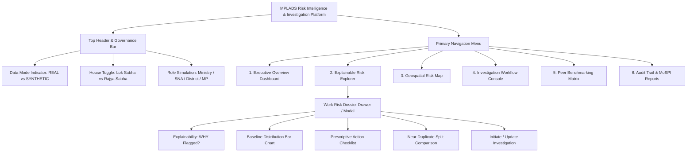

# UI Information Architecture & Design System

## Project Details
- **Problem Statement ID:** 26102
- **Title:** Development of an AI-powered system to detect anomalies, fraud, and inefficiencies in MPLAD Scheme implementation
- **Platform:** MPLADS Risk Intelligence & Investigation Platform (RIIP)

---

## 1. Information Architecture Hierarchy

---

## 2. Design System & GovTech Aesthetics

The interface adopts a polished, high-authority Government of India digital design system adhering to MoSPI branding standards:

### 2.1 Color Palette
- **Primary Navy:** `#0d2b45` (Headers, branding, authoritative cards).
- **National Forest Green / Emerald:** `#1a936f` (Sanctioned works, verified low-risk, approved status).
- **Gov Alert Amber:** `#f59e0b` (Medium risk, pending inspection, statutory milestone warning).
- **Risk Crimson:** `#dc2626` (Critical risk, statutory 365-day stall, extreme cost outlier).
- **Neutral Slate Canvas:** `#f8fafc` background with `#ffffff` container cards and `#e2e8f0` subtle borders.

### 2.2 Typography & Iconography
- **Typography:** Modern clean sans-serif (`Inter` or `Montserrat` per MoSPI guidelines) with rigorous hierarchy (Display `text-2xl font-bold`, Metric `text-3xl font-extrabold`, Label `text-xs uppercase tracking-wider`).
- **Icons:** Crisp Lucide-React icons (`ShieldAlert`, `FileCheck`, `Activity`, `MapPin`, `Building2`, `HelpCircle`).

---

## 3. Screen Specifications

### 3.1 Screen 1: Executive Overview Dashboard
**Purpose:** National and state-level situational awareness for Ministry Officials and State Nodal Authorities.
- **Top Government Strip:** Displays MoSPI crest, DIID department label, live data refresh indicator, and current tenure (`18th Lok Sabha`).
- **Data Source Banner:** Transparent toggle between:
  - `[● Official eSAKSHI Live Feed]`
  - `[★ Demo Anomaly Benchmark Suite]`
- **Macro KPI Metric Cards:**
  1. *Total Works Recommended & Sanctioned* (Count + Value in ₹ Crores).
  2. *Total Expenditure Released* (Disbursed ₹ + Utilization %).
  3. *Completed Works* (Count + Statutory 1-Year Compliance %).
  4. *Flagged Risk Indicators* (Total flagged + Breakdown by Critical / High / Medium).
- **Visual Analytics Widgets:**
  - *Monthly Expenditure Velocity Trend:* Multi-line chart comparing recommendations, sanctions, and actual payments over time.
  - *Category Cost Distribution:* Donut chart breaking down works by `Normal/Others`, `Trust & Society`, `Repair & Renovation`, `Bar & Associations`.
  - *State Risk Heat Ranking:* Sortable horizontal bar chart displaying anomaly percentage across states.

---

### 3.2 Screen 2: Explainable Risk Explorer
**Purpose:** Triage and exploration table allowing investigators to sort, search, and filter flagged works.
- **Multi-Filter Bar:**
  - State & District dropdowns (hierarchically linked).
  - Category selector (`Normal/Others`, `Trust & Society`, etc.).
  - Severity filter (`Critical`, `High`, `Medium`, `Low`).
  - Anomaly Engine filter (`Cost Outlier`, `Statutory Delay`, `Near-Duplicate`, `Advance Overpayment`, `Vendor Concentration`).
- **Data Grid Columns:**
  1. *Work ID & Name* (with instant copyable badge).
  2. *Location* (State / District / Block / Village).
  3. *Sanction Amount* (₹ Lakhs).
  4. *Days Since Sanction* (Highlighting $>365$ days in amber/red).
  5. *Primary Risk Indicator* (Text summary tag e.g. `Cost +84% vs Median`).
  6. *Composite Risk Score* (0–100 progress badge with color-coded severity).
  7. *Review Status* (`Unreviewed`, `In Review`, `Inspection Pending`, `Closed`).
  8. *Action:* "Open Dossier" button.

---

### 3.3 Screen 3: The Explainable Risk Dossier (Core Differentiator)
**Purpose:** The central investigative tool that answers **"WHY was this project flagged?"**
Accessible via slide-over drawer or dedicated dossier view:

#### Section A: The Plain-English Rationale Header
- Clear, objective summary statement:
  > *"This project has been flagged with a **HIGH Risk Indicator (Score: 78.4/100)** due to an observed unit cost variance of **+84.2%** over the district category median, coupled with an execution stall exceeding 280 days."*

#### Section B: Trigger Factor Attribution Breakdown
- Cards for each triggered engine with individual sub-scores, weights, and explicit evidence:
  - **Factor 1: Cost Outlier:** Shows Observed Sanction (₹9.76L) vs District Median (₹5.30L).
  - **Factor 2: Milestone Stall:** Shows Days Elapsed (280d) vs Expected 75% Completion (Actual: 15%).
  - **Factor 3: Duplicate Flag:** Displays side-by-side snippet with matched work ID and 88.4% text similarity.

#### Section C: Dynamic Baseline Distribution Bar
- Interactive Recharts visual rendering a horizontal percentile bar:
  - Markers for $P_{25}$ (₹4.2L), $\text{Median}$ (₹5.3L), $P_{75}$ (₹6.8L), $P_{95}$ (₹8.5L).
  - Highlighted pin showing the project’s observed cost (₹9.76L) placed well beyond the upper boundary.

#### Section D: Prescriptive Verification Action Checklist
- Actionable, step-by-step guidance for field officers:
  - [ ] Step 1: Verify Measurement Book (MB) entry against approved technical estimate.
  - [ ] Step 2: Conduct geo-tagged site inspection to confirm no overlap with previous works.
  - [ ] Step 3: Audit vendor payment vouchers against physical foundation status.

#### Section E: Investigation Action Panel
- Status dropdown: `Mark as Under Review`, `Request Clarification from IA`, `Schedule Site Inspection`, `Accept Explanation (Close File)`, `Escalate to Special Audit`.
- Reviewer note textarea and "Submit Administrative Decision" button.

---

### 3.4 Screen 4: Geospatial Risk Map
**Purpose:** Geographic anomaly clustering and proximity visualization.
- Fullscreen Leaflet map with dark/light GovTech tile layers.
- Custom SVG project pins color-coded by composite risk score.
- **Proximity Halo Overlay:** 500-meter circular buffer rendered around suspicious near-duplicate pairs.
- Clicking any marker opens a mini-dossier popup with instant navigation to the full dossier.

---

### 3.5 Screen 5: Peer Benchmarking Matrix
**Purpose:** Macro-level comparative governance across constituencies and agencies.
- Compare an MP’s expenditure velocity and average unit costs against regional peer averages.
- IA Vendor Dependency Chart: Highlights Implementing Agencies where $>50\%$ of fund flow is awarded to a single private contractor.

---

### 3.6 Screen 6: Investigation Queue & Audit Trail
**Purpose:** Workflow tracking and tamper-evident compliance.
- Filter by investigator status.
- Immutable chronological timeline displaying every status transition, user role, note, and timestamp.
- "Export Audit Dossier (PDF/CSV)" button for official ministry record-keeping.
