# 2-Day MVP Implementation Plan (Hackathon Execution Schedule)

## Project Details
- **Problem Statement ID:** 26102
- **Title:** Development of an AI-powered system to detect anomalies, fraud, and inefficiencies in MPLAD Scheme implementation
- **Platform:** MPLADS Risk Intelligence & Investigation Platform (RIIP)
- **Objective:** Deliver a fully functional, end-to-end working software prototype within 48 hours for SIH 2026.

---

## High-Level Milestone Map

```mermaid
gantt
    title SIH 2026: 48-Hour MVP Sprint Schedule
    dateFormat X
    axisFormat %H h

    section Day 1: Core Engine & APIs
    Environment & Schema Setup         :m1, 0, 4
    Live eSAKSHI Client & Synthetics   :m2, 4, 8
    Hybrid Analytics & XAI Engines     :m3, 8, 14
    Composite Scoring & Calibration   :m4, 14, 18
    FastAPI REST Endpoints & Testing   :m5, 18, 24

    section Day 2: UI & Verification
    React + Tailwind + shadcn Scaffold :m6, 24, 28
    Executive Dashboard & Visuals     :m7, 28, 33
    Risk Explorer & XAI Dossier Drawer :m8, 33, 38
    Investigation Workflow & Audit    :m9, 38, 42
    Geospatial Map & End-to-End Demo   :m10, 42, 48
```

---

## Detailed 48-Hour Hour-by-Hour Breakdown

### DAY 1: Foundation, Data Ingestion, Hybrid Analytics Core, and Backend APIs

#### Hours 0 – 4: Monorepo Setup, Dependencies & Database Architecture
- **Task 1.1:** Initialize monorepo structure (`/backend`, `/frontend`, `/data`, `/tests`).
- **Task 1.2:** Configure Python backend environment with `FastAPI`, `SQLAlchemy`, `pydantic v2`, `pandas`, `scikit-learn`, `httpx`, `pytest`.
- **Task 1.3:** Implement SQLAlchemy relational schema in `backend/app/models/` matching the Database Schema Specification (`states`, `districts`, `constituencies`, `members_of_parliament`, `implementing_agencies`, `vendors`, `works`, `expenditures`, `risk_anomalies`, `investigations`, `audit_logs`).
- **Task 1.4:** Initialize SQLite database in WAL mode (`backend/app/db/session.py`) with foreign key enforcement and performance indexes.

#### Hours 4 – 8: Data Ingestion Pipeline & Synthetic Benchmark Seeder
- **Task 2.1:** Implement `services/esakshi_client.py` with asynchronous client querying live MoSPI eSAKSHI endpoints (`getStateData`, `getTilesData`, `getTilesReportData`).
- **Task 2.2:** Build data normalization utility (`services/data_normalizer.py`) standardizing currency strings, dates (`DD-Mon-YYYY` to ISO), and null values.
- **Task 2.3:** Implement synthetic benchmark seeder (`backend/app/db/seed_demo_data.py`) embedding:
  - 520 realistic works across 8 States and 24 Districts.
  - The 7 intentionally engineered anomaly cases (Scenarios A through G: tender threshold splitting, 110m near-duplicate community hall, PCC road cost outlier, advance overpayment, chronic 365-day stall, vendor monopolization, trust cap breach).
  - Explicit `is_synthetic` tagging.

#### Hours 8 – 14: Hybrid Analytics & Multi-Engine Implementation
- **Task 3.1:** Implement **Engine 1 (Deterministic Domain Rules):** 1-year statutory completion mandate, ₹10L tender threshold splitting, ₹75L trust ceiling, photo status compliance.
- **Task 3.2:** Implement **Engine 2 (Statistical Outlier Detection):** Categorical and regional stratification, Median Absolute Deviation (MAD), robust Modified Z-Score, and non-parametric IQR fences.
- **Task 3.3:** Implement **Engine 3 (Unsupervised ML):** Scikit-learn `IsolationForest` on multidimensional standardized vectors.
- **Task 3.4:** Implement **Engine 4 (Near-Duplicate & Text-Spatial Similarity):** Character/word n-gram TF-IDF vectorizer + Cosine Similarity + Haversine distance 500m proximity buffer.
- **Task 3.5:** Implement **Engine 5 (Payment Velocity & Progress Incongruity):** $\Delta_{\text{incongruity}} = \text{DisbursedPct} - \text{PhysicalProgressPct}$.
- **Task 3.6:** Implement **Engine 6 (Vendor & Agency Monopolization):** Herfindahl-Hirschman Index (HHI) calculation per district.

#### Hours 14 – 18: Composite Risk Engine & Explainability Pipeline
- **Task 4.1:** Build `services/risk_engine.py`: Weighted additive composite score formulation, confidence calibration, and severity categorization (`LOW`, `MEDIUM`, `HIGH`, `CRITICAL`).
- **Task 4.2:** Build `services/explainability_service.py`: Generates human-readable, non-accusatory rationale cards, extracts numerical comparison baselines (Observed vs. Median/$P_{75}$/$P_{95}$), and maps prescriptive verification checklists.

#### Hours 18 – 24: REST API Gateway & Backend Verification
- **Task 5.1:** Implement FastAPI endpoints in `backend/app/api/v1/endpoints/`:
  - `GET /dashboard/summary`, `GET /dashboard/category-breakdown`
  - `GET /works`, `GET /works/{work_id}`
  - `GET /anomalies`, `GET /anomalies/{work_id}/dossier`
  - `POST /investigations/{work_id}/review`, `GET /investigations/queue`
  - `GET /geospatial/risk-map`
  - `POST /esakshi/sync`, `POST /demo/reset-seed`
- **Task 5.2:** Run automated test suite with `pytest` ensuring 100% detection of Scenarios A–G and $<4\%$ false discovery rate on baseline noise.

---

### DAY 2: Frontend Engineering, Visual Analytics, Investigation Console & Integration

#### Hours 24 – 28: Modern Frontend Scaffolding & Design System
- **Task 6.1:** Bootstrap React 18 + TypeScript application with Vite in `/frontend`.
- **Task 6.2:** Configure Tailwind CSS with government palette (Primary Navy `#0d2b45`, Emerald `#1a936f`, Amber `#f59e0b`, Crimson `#dc2626`).
- **Task 6.3:** Install shadcn/ui components (`Button`, `Card`, `Badge`, `Dialog`, `Drawer`, `Table`, `Select`, `Tabs`, `Separator`, `DropdownMenu`).
- **Task 6.4:** Configure API client with Axios and TanStack React Query v5.
- **Task 6.5:** Build authoritative GovBar, Header, Data Mode Switcher (`[REAL eSAKSHI]` vs `[DEMO BENCHMARK]`), and Sabha Switcher (`Lok Sabha` vs `Rajya Sabha`).

#### Hours 28 – 33: Executive Overview Dashboard
- **Task 7.1:** Implement 4 macro KPI metric cards (Total Works, Total Expenditure & Utilization %, Completed Works & 1-Year Compliance %, Flagged Works & Risk Breakdown).
- **Task 7.2:** Build interactive Recharts charts:
  - Monthly Expenditure Velocity curves.
  - Category breakdown Donut chart.
  - State Risk Heat horizontal bar chart.
- **Task 7.3:** Wire live state/constituency filter dropdowns.

#### Hours 33 – 38: Risk Explorer & Explainable Risk Dossier Drawer
- **Task 8.1:** Build `RiskExplorer.tsx`: High-performance data table with search, multi-filter by state/district/severity/engine, and sortable composite scores.
- **Task 8.2:** Implement **The Explainable Risk Dossier Drawer (`ExplainabilityDossier.tsx`):**
  - Section A: Plain-English objective summary answering **"WHY was this project flagged?"**
  - Section B: Trigger factor attribution breakdown cards with individual weights, severity, and evidence values.
  - Section C: Recharts Percentile Distribution Bar ($P_{25}$, Median, $P_{75}$, $P_{95}$, Observed value pin).
  - Section D: Actionable Verification Guidance Checklist.
  - Section E: Near-duplicate split comparison view for co-located flags.

#### Hours 38 – 42: Investigation Workflow Console & Immutable Audit Trail
- **Task 9.1:** Build `InvestigationQueue.tsx`: Reviewer console with workflow states (`Open`, `In Review`, `Inspection Scheduled`, `Resolved`, `Escalated`).
- **Task 9.2:** Implement Review Action Modal: Change status, enter administrative reviewer observations, assign roles.
- **Task 9.3:** Build Chronological Audit Log Timeline widget rendering tamper-evident history with timestamp, actor role, and previous/new state snapshots.

#### Hours 42 – 48: Geospatial Risk Map, System Polish & Hackathon Demo Preparation
- **Task 10.1:** Implement `GeoSpatialView.tsx` with Leaflet / React-Leaflet:
  - Custom SVG map markers color-coded by risk severity.
  - 500-meter proximity buffer circles around co-located duplicate pairs.
  - Interactive popup card with direct link to open the Explainability Dossier.
- **Task 10.2:** End-to-end integration testing: Toggle between Live eSAKSHI data mode and Demo Benchmark mode.
- **Task 10.3:** Clean up UI tooltips, empty states, loading skeletons, and produce demo walkthrough script highlighting SIH 26102 MoSPI requirements.
