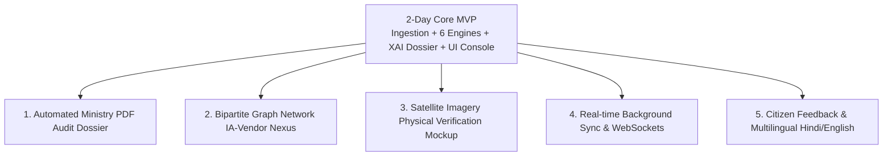

# 3-Day Stretch Plan (Enterprise & Advanced Capabilities)

## Project Details
- **Problem Statement ID:** 26102
- **Title:** Development of an AI-powered system to detect anomalies, fraud, and inefficiencies in MPLAD Scheme implementation
- **Platform:** MPLADS Risk Intelligence & Investigation Platform (RIIP)
- **Objective:** Advanced capabilities elevating the hackathon MVP into an enterprise-grade platform for MoSPI DIID adoption.

---

## 1. Overview of Stretch Capabilities

Following completion of the 2-Day core MVP, Day 3 focuses on **five high-impact differentiators** that showcase forward-looking technical innovation, deep departmental empathy, and institutional readiness:

---

## 2. Advanced Feature Specifications

### 2.1 Automated PDF Audit Dossier Generation
- **Problem Addressed:** Field officers (District Magistrates, Sub-Divisional Officers) require portable, legally admissible physical paperwork during site inspections where internet access is unavailable.
- **Implementation:**
  - Python backend engine using `ReportLab` / `WeasyPrint` rendering an official MoSPI-formatted PDF dossier.
  - Generates:
    - Official MoSPI header and watermarked case tracking number.
    - Full project specifications and financial disbursement schedule.
    - Visual boxplot and percentile baseline comparison chart embedded as vector graphics.
    - Plain-language explainability attribution breakdown.
    - Pre-printed "Field Physical Verification Checklist" with formal sign-off signature blocks for Executive Engineers and District Planning Officers.
  - Triggered via instant "Download Field Inspection Dossier" button in the UI.

### 2.2 Bipartite Graph Network Visualization (IA-Vendor-MP Nexus)
- **Problem Addressed:** Monopolization and procurement cartels often span multiple projects where individual works appear benign, but the overarching award network reveals systemic favoritism.
- **Implementation:**
  - Graph analytics service constructing bipartite networks $G = (V_{\text{agency}} \cup V_{\text{vendor}}, E_{\text{contracts}})$ with edge weights proportional to disbursed funds.
  - Interactive force-directed canvas in frontend (using D3.js or React-Force-Graph).
  - Visual metrics: Node degree centrality, PageRank, and community clustering identifying:
    - Vendor hubs receiving contracts across multiple seemingly independent agencies.
    - Unusually tight clusters between specific District Planning Officers and preferred suppliers.

### 2.3 Satellite Imagery Physical Verification Integration (Earth Observation AI)
- **Problem Addressed:** MPLADS guidelines mandate durable community asset creation; however, "ghost projects" or unbuilt roads may be certified as complete on paper.
- **Implementation:**
  - Integration interface for Sentinel-2 / Landsat-8 open satellite optical imagery (or high-resolution simulated imagery).
  - For projects reporting 100% completion (e.g. PCC roads or community grounds), loads before-and-after satellite tiles based on `latitude` and `longitude`.
  - Normalized Difference Vegetation Index (NDVI) and Structural Surface Reflectance change detection metric confirming that ground disturbance and paving occurred during the sanction period.

### 2.4 Real-Time Background Sync Worker & WebSocket Alerts
- **Problem Addressed:** Batch processing introduces latency; nodal officers need immediate notifications when a newly sanctioned work exhibits high anomaly flags.
- **Implementation:**
  - Asynchronous background worker (`asyncio` scheduler / Celery compatible) polling eSAKSHI incremental changes.
  - Event-driven WebSocket channel emitting live toast alerts to logged-in District and State dashboards whenever a `HIGH` or `CRITICAL` risk is flagged.

### 2.5 Citizen Transparency & Multilingual Support (Hindi & English)
- **Problem Addressed:** Transparency to citizens and linguistic accessibility across diverse parliamentary constituencies.
- **Implementation:**
  - Full internationalization (`i18next`) supporting English and Hindi (हिन्दी) terminology mirroring the official eSAKSHI bilingual navigation.
  - Public Citizen Mode: Read-only, anonymized dashboard view enabling constituency citizens to verify works sanctioned in their Gram Panchayat, view uploaded asset photographs, and submit civic verification ratings.

---

## 3. Stretch Schedule (Day 3 Timeline)

| Time Window | Milestone | Deliverable |
| :--- | :--- | :--- |
| **Hours 48 – 54** | Automated PDF Generation | Endpoint `GET /anomalies/{work_id}/pdf-report` returning official multi-page PDF. |
| **Hours 54 – 60** | Bipartite Graph Nexus | Interactive D3/Force-graph screen visualising vendor-agency contract flows. |
| **Hours 60 – 64** | Satellite Verification Mockup | Split-view satellite tile component showing before/after coordinate changes. |
| **Hours 64 – 68** | Real-Time Notifications & i18n | Hindi/English toggle + WebSocket live notification toaster. |
| **Hours 68 – 72** | Final Hardening & Pitch Prep | End-to-end rehearsal, edge-case hardening, and deployment packaging. |
