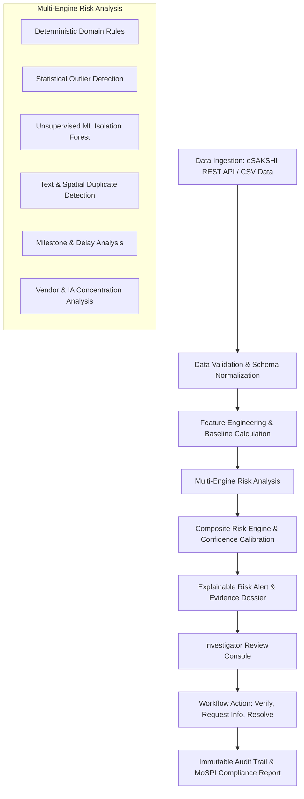

# Product Requirements Document (PRD)

## Project Details
- **Problem Statement ID:** 26102
- **Title:** Development of an AI-powered system to detect anomalies, fraud, and inefficiencies in MPLAD Scheme implementation
- **Sponsor Organization:** Ministry of Statistics and Programme Implementation (MoSPI)
- **Department:** Data Informatics & Innovation Division (DIID)
- **Theme:** Smart Automation / Risk Intelligence / Public Financial Governance
- **Platform Name:** **MPLADS Risk Intelligence & Investigation Platform (RIIP)**

---

## 1. Executive Summary & Vision

The Members of Parliament Local Area Development Scheme (MPLADS) is an essential Central Sector Scheme enabling Members of Parliament (both Lok Sabha and Rajya Sabha) to recommend developmental works addressing local public needs—with an annual entitlement of ₹5 Crore per MP. Following the MoSPI reform of April 1, 2023, the scheme transitioned entirely to the digital **eSAKSHI** portal (`mplads.mospi.gov.in`), establishing revised fund-flow guidelines, digital vendor invoicing, asset photograph uploads, and milestones.

However, across 543 Lok Sabha and 245 Rajya Sabha constituencies with tens of thousands of active works per year (e.g., 110,000+ works recommended and ₹8,300+ Cr allocated limit in the 18th Lok Sabha alone), manual oversight cannot effectively detect subtle systemic irregularities. Such issues include:
- Artificially split projects designed to bypass public procurement thresholds.
- Geographically proximal or verbatim near-duplicate recommendations.
- Chronic execution stalls violating the statutory 1-year completion timeline.
- Severe unit cost discrepancies compared to regional peers.
- Disproportionate advance disbursements without commensurate physical progress.
- Single-vendor or single-agency monopolization risks.

**Vision:** The MPLADS Risk Intelligence & Investigation Platform (RIIP) transforms raw administrative project data into **explainable, actionable risk intelligence**. It does NOT make subjective fraud accusations; instead, it empowers nodal authorities with mathematically backed signals, baselines, and guided verification workflows.

---

## 2. Core Product Principles

### 2.1 The Principle of Objective Non-Accusation
The system strictly adheres to the principle of judicial fairness and objective administrative reporting.
- **Prohibited Terminology:** The platform **must NEVER** classify a project or official as "corrupt", "fraudulent", or "guilty".
- **Mandated Terminology:** The platform **must ALWAYS** use calibrated, neutral language:
  - *"Anomaly detected"*
  - *"Risk indicator"*
  - *"Requires administrative review"*
  - *"Unusual expenditure velocity"*
  - *"Physical verification recommended"*
  - *"Variance exceeds baseline tolerance"*

### 2.2 Core Differentiator: Explainable AI (XAI)
Every flagged project must instantly answer the investigator's question: **"Why was this project flagged?"**
Every alert includes:
1. **Triggering Factor(s):** Clear textual statement of what threshold or statistical rule was breached.
2. **Comparison Baseline:** Quantified peer metric (e.g., district median cost of ₹1,420/meter for PCC roads).
3. **Observed vs. Expected:** Direct numerical comparison (e.g., ₹2,850/meter vs. ₹1,420/meter; +100.7% variance).
4. **Signal Confidence & Severity:** Calibrated score (Low / Medium / High / Critical) with statistical confidence.
5. **Recommended Verification Action:** Prescriptive checklist for physical inspection or document audit.
6. **Supporting Evidence Dossier:** Linked sanction orders, invoice timelines, similarity score matches, and map coordinates.

### 2.3 Real vs. Synthetic Data Transparency
The system must never mislead reviewers by blending simulated data into official records without explicit notice:
- **Badge Indicators:** Prominently badge every screen, record, and export as either `[OFFICIAL eSAKSHI DATA]` or `[DEMO / SYNTHETIC CASE]`.
- **Mode Toggle:** Allow switching between live/ingested public data and demonstration scenarios seeded with synthetic anomaly benchmarks.

---

## 3. Primary User Personas & User Journeys

| Persona | Level | Primary Needs & Actions | Key UI Screen |
| :--- | :--- | :--- | :--- |
| **Ministry Official (MoSPI / DIID)** | Central | National macro-trends, state-level performance indices, cross-state anomaly clusters, allocation vs. expenditure velocity. | Executive National Risk Dashboard |
| **State Nodal Authority (SNA)** | State | Inter-district comparisons, systemic agency performance, identifying districts lagging in 1-year completion compliance. | State Analytics & Anomaly Matrix |
| **District Authority (NDA / IDA / DC / DM)** | District | Ground-level project feasibility, sanction monitoring, vendor disbursement verification, dispatching physical inspection teams. | District Project & Vendor Investigation Console |
| **MP / Constituency Reviewer** | Constituency | Tracking recommendation status, sanction turnaround times, identifying stalled works, ensuring fund utilization efficiency. | Constituency Performance & Project Dossier |

---

## 4. End-to-End Core Workflow

---

## 5. Functional Requirements

### FR-1: Data Ingestion & Harmonization
- **FR-1.1:** Direct live proxy/cache connectivity with eSAKSHI pre-login public endpoints:
  - `getStateData`, `getConstituencyData`, `getMpNamesData`, `getTilesData`, `getTilesReportData`.
- **FR-1.2:** Multi-format ingestion support (JSON, CSV, Excel) for legacy or batch data dumps.
- **FR-1.3:** Automated data cleaning: standardizing date formats (`DD-Mon-YYYY` vs `ISO 8601`), currency parsing (Lakhs, Crores, INR strings), and entity disambiguation (sanitizing MP and District names).
- **FR-1.4:** Dual data store maintaining distinct partitions for verified real data and synthetic test suites.

### FR-2: Anomaly & Risk Detection Engines
- **FR-2.1: Cost & Estimate Variance Engine:** Detects extreme deviations in estimated costs and sanction amounts relative to work category and district median costs.
- **FR-2.2: Statutory Timeline & Stall Engine:** Flags projects exceeding the 1-year statutory completion mandate from sanction date without commensurate physical progress updates.
- **FR-2.3: Near-Duplicate & Work-Splitting Engine:** Identifies suspiciously similar work descriptions (TF-IDF Cosine Similarity > 0.82 and Levenshtein distance) within identical blocks/villages or within a 500-meter GPS radius. Flags multiple works sanctioned just below tender thresholds (e.g. ₹9.9 Lakhs).
- **FR-2.4: Payment Velocity & Disbursement Incongruity Engine:** Identifies payments released without mandatory stage photos, front-loaded disbursements (>80% payment with <20% work progress), or rapid disbursement spikes right before election tenures.
- **FR-2.5: Vendor & Implementing Agency Concentration Engine:** Calculates Herfindahl-Hirschman Index (HHI) and Gini coefficients to detect disproportionate allocation to specific private contractors or single IAs.
- **FR-2.6: Peer Group Deviation Engine:** Evaluates performance of an MP constituency against peers of similar geographic/demographic typology.

### FR-3: Explainability & Decision Support Engine
- **FR-3.1:** Auto-generation of plain-language, neutral rationale cards for every flagged risk.
- **FR-3.2:** Dynamic visual baseline comparison charts showing project value vs. 25th percentile, median, 75th percentile, and 95th percentile bounds.
- **FR-3.3:** Prescriptive "Verification Guidance Checklist" tailored to the specific risk type (e.g., "Check foundation depth", "Verify physical measurement book (MB) record", "Inspect vendor GST active status").

### FR-4: Investigation Review & Workflow Management
- **FR-4.1:** State-based investigation lifecycle: `Under Investigation`, `Info Requested from IA`, `Inspection Scheduled`, `Explanation Accepted / Closed`, `Escalated for Audit`.
- **FR-4.2:** Investigator note-taking, file/evidence attachment, and timestamped logging.
- **FR-4.3:** Immutable audit trail recording every state change, reviewer comment, and export.

### FR-5: Geospatial Risk Mapping
- **FR-5.1:** Interactive map visualization rendering project markers colored by composite risk score.
- **FR-5.2:** Cluster view with spatial proximity buffers highlighting co-located works.

---

## 6. Non-Functional Requirements (NFRs)

- **NFR-1 (Performance):** Dashboard aggregation queries under 250ms for 50,000+ records in SQLite/PostgreSQL. Batch risk evaluation runs within 10 seconds for 100,000 records.
- **NFR-2 (Explainability Latency):** Individual project risk breakdown rendered in < 50ms upon user selection.
- **NFR-3 (Reliability & Graceful Degradation):** If live MoSPI eSAKSHI endpoints are unreachable or throttling, system seamlessly falls back to cached snapshots and cached synthetic demo sets without error screens.
- **NFR-4 (Security & Compliance):** Role-based access simulation for Ministry, State, District, and MP tiers. All data modification ops protected with audit logs.
- **NFR-5 (Usability):** High-contrast, clean GovTech UI compliant with modern accessibility standards, responsive across desktop and tablet interfaces.

---

## 7. Metrics & Key Performance Indicators (KPIs)

1. **Explainability Coverage:** 100% of flagged records must contain explicit triggering factors, baselines, and verification steps.
2. **False Discovery Calibration:** Less than 5% benign anomalies flagged as "High" or "Critical" risk under benchmark test datasets.
3. **Investigation Efficiency Gain:** Reduction in manual triage time by estimated 75% for District and State audit officers.
4. **Data Fidelity:** 100% adherence to official eSAKSHI schemas without synthetic attribute collision.
