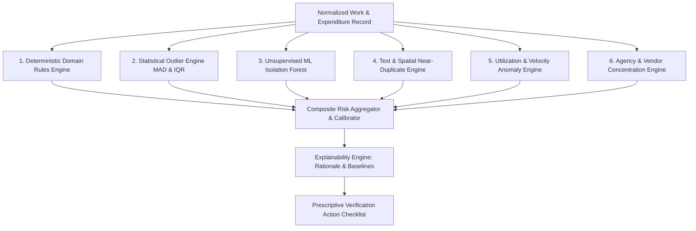

# Analytics & Anomaly Detection Methodology

## Project Details
- **Problem Statement ID:** 26102
- **Title:** Development of an AI-powered system to detect anomalies, fraud, and inefficiencies in MPLAD Scheme implementation
- **Platform:** MPLADS Risk Intelligence & Investigation Platform (RIIP)

---

## 1. Architectural Philosophy: The Hybrid AI Model

In accordance with strict public financial governance and judicial explainability, the platform **rejects opaque black-box neural networks** (e.g., deep networks trained on fake labels) in favor of a **rigorous, multi-tier Hybrid Risk Engine**. 

Every flag generated by the platform is mathematically verifiable, grounded in official MoSPI eSAKSHI administrative guidelines, and fully decomposed into transparent attribution factors.

---

## 2. Engine 1: Deterministic Domain Rules (MoSPI Guidelines)

Ground truth rules derived directly from the official MPLADS Guidelines (revised fund-flow procedure post-April 1, 2023):

### Rule 1.1: The Statutory 1-Year Execution Mandate
- **Guideline Clause:** Sanctioned works must be completed within **one calendar year (365 days)** of the sanction order issued by the District Authority.
- **Rule Formulation:**
  $$\text{DaysElapsed} = \text{CurrentDate} - \text{SanctionDate}$$
  $$\text{If } \text{DaysElapsed} > 365 \text{ and } \text{WorkStatus} \neq \text{'Completed'}:$$
  $$\text{Penalty}_{\text{stall}} = \min\left(30, 10 + \frac{\text{DaysElapsed} - 365}{30} \times 2.5\right)$$

### Rule 1.2: Threshold Splitting (Tender Bypass Indicator)
- **Administrative Context:** Public procurement rules require formal competitive e-tendering for works exceeding ₹10 Lakhs. Contractors and corrupt authorities may split a ₹25 Lakh road project into three separate ₹9.8 Lakh projects to utilize discretionary quotation approvals.
- **Rule Formulation:** Flag when an MP/IA recommends $\ge 2$ works in the same block/village within a 30-day window with amounts $A_i \in [₹9,50,000, ₹9,99,999]$.

### Rule 1.3: Trust and Society Financial Cap
- **Guideline Clause:** Total recommendations to commercial/private trusts or societies must not exceed the statutory ceiling of ₹75 Lakhs per MP across their tenure.
- **Rule Formulation:** Flag any work under category `Trust and Society` where cumulative MP allocation to that trust exceeds ₹75 Lakhs.

### Rule 1.4: Final Disbursement Without Mandatory Photo Upload
- **Guideline Clause:** Implementing Agencies are required to upload geo-tagged asset photographs at milestone stages and completion prior to release of final payment.
- **Rule Formulation:**
  $$\text{If } \text{FundDisbursedPct} \ge 90\% \text{ and } \text{FileStatus} \neq \text{'AVAILABLE'}:$$
  $$\text{Severity} = \text{HIGH (Mandatory verification before file closure)}$$

---

## 3. Engine 2: Statistical Outlier Detection (Category & Regional Stratification)

Because unit costs vary across terrain (e.g., hill states vs. plain states) and work types (e.g., CC drains vs. High-Mast LED lights), costs are stratified by `(work_category, activity_name, state_type)`.

### 3.1 Robust Modified Z-Score using Median Absolute Deviation (MAD)
Standard mean-variance Z-scores are vulnerable to extreme outliers. We employ the **Modified Z-Score** ($M_i$):

$$\tilde{x} = \text{median}(X)$$
$$\text{MAD} = \text{median}(|x_i - \tilde{x}|)$$
$$M_i = \frac{0.6745 \times (x_i - \tilde{x})}{\text{MAD}}$$

- **Interpretation:**
  - $|M_i| \le 2.0$: Typical baseline range.
  - $2.0 < |M_i| \le 3.5$: Moderate statistical deviation (**Medium Risk**).
  - $|M_i| > 3.5$: Extreme statistical outlier (**High/Critical Risk**).

### 3.2 Non-Parametric IQR Fences
$$\text{IQR} = Q_3 - Q_1$$
$$\text{Upper Outer Fence} = Q_3 + 3.0 \times \text{IQR}$$
$$\text{If } x_i > \text{Upper Outer Fence}: \text{CostOutlierScore} = 100$$

---

## 4. Engine 3: Unsupervised Machine Learning (Isolation Forest)

To detect non-linear, multi-dimensional anomalies where no single parameter violates a threshold, we apply an **Isolation Forest** trained on standardized multi-attribute tuples:

$$\vec{v}_i = \begin{bmatrix} \log_{10}(\text{SanctionAmount}) \\ \frac{\text{SanctionAmount}}{\text{EstimatedCost}} \\ \frac{\text{FundDisbursed}}{\text{SanctionAmount}} \\ \frac{\text{CurrentDate} - \text{SanctionDate}}{\text{TargetDays}} \\ \text{PhysicalProgressPct} \end{bmatrix}$$

### Isolation Forest Mechanics:
1. Recursive random partitioning builds an ensemble of $T = 150$ completely random trees.
2. Anomalous points are isolated at much shallower depths $h(x)$ than normal data points.
3. The anomaly score $s(x, n)$ is computed as:
   $$s(x, n) = 2^{-\frac{E(h(x))}{c(n)}}$$
   where $c(n) = 2 \ln(n - 1) + 0.5772156649 - \frac{2(n - 1)}{n}$.
4. Calibrated score $\in [0, 1]$ where scores $> 0.65$ denote multivariate structural irregularity.

---

## 5. Engine 4: Near-Duplicate & Text-Spatial Similarity Detection

Detects works recommended for identical physical assets previously funded or simultaneously sanctioned under different nomenclature.

### 5.1 Text Lexical & Semantic Similarity
1. **Pre-processing:** Work description text is sanitized (lowercased, punctuation stripped, stop-words removed, and standardized abbreviations mapped: "P.C.C" $\to$ "pcc", "comm hall" $\to$ "community hall").
2. **TF-IDF Vectorization:** Compute character n-gram (range 2–4) and word n-gram (range 1–2) TF-IDF vectors:
   $$\text{TF-IDF}(t, d) = \text{TF}(t, d) \times \ln\left(\frac{1 + N}{1 + \text{DF}(t)}\right)$$
3. **Cosine Similarity:**
   $$\text{Sim}_{\text{text}}(d_1, d_2) = \frac{\vec{v}_1 \cdot \vec{v}_2}{\|\vec{v}_1\| \|\vec{v}_2\|}$$

### 5.2 Geospatial Proximity Buffer (Haversine Formula)
$$d = 2R \arcsin \left(\sqrt{\sin^2\left(\frac{\Delta \phi}{2}\right) + \cos(\phi_1)\cos(\phi_2)\sin^2\left(\frac{\Delta \lambda}{2}\right)}\right)$$
where $R = 6,371 \text{ km}$.

### 5.3 Co-location Duplicate Score
$$\text{If } d \le 0.5 \text{ km (500 meters)} \text{ and } \text{Sim}_{\text{text}} \ge 0.78:$$
$$\text{DuplicateRisk} = \text{Sim}_{\text{text}} \times \left(1 - \frac{d}{0.5}\right) \times 100$$
Identifies duplicate work claims in identical municipal wards or rural survey numbers.

---

## 6. Engine 5: Utilization & Payment Velocity Anomalies

### 6.1 Payment-to-Progress Incongruity
A common administrative vulnerability occurs when a contractor receives substantial disbursements while the physical asset remains unbuilt:

$$\Delta_{\text{incongruity}} = \left(\frac{\text{FundDisbursedAmt}}{\text{SanctionAmount}} \times 100\right) - \text{PhysicalProgressPct}$$
- If $\Delta_{\text{incongruity}} > 50\%$ (e.g. 80% money disbursed, but only 20% work done):
  $$\text{Score}_{\text{velocity}} = 85 \text{ (High Risk: Advance Overpayment)}$$

### 6.2 Pre-Tenure Rush Expenditure Spikes
Calculates the 30-day moving average of payment release velocity in the 90 days preceding tenure expiry compared to the MP's historical 5-year average rate.

---

## 7. Engine 6: Agency & Vendor Monopolization (HHI & Gini)

Evaluates whether an Implementing Agency or District disproportionately channels works to a preferred private contractor.

### Herfindahl-Hirschman Index (HHI):
$$\text{HHI}_{\text{district}} = \sum_{j=1}^K s_j^2$$
where $s_j$ is the percentage market share of vendor $j$ in the district's total MPLADS expenditure:
- $\text{HHI} < 1,500$: Competitive, healthy allocation.
- $1,500 \le \text{HHI} \le 2,500$: Moderate concentration.
- $\text{HHI} > 2,500$: Highly concentrated (**Vendor Monopolization Indicator**).

---

## 8. Composite Risk Engine & Explainability Pipeline

### 8.1 Transparent Additive Formulation
$$\text{Composite Risk} = \min\left(100, \sum_{k=1}^6 w_k \cdot S_k\right)$$

| Sub-Engine ($k$) | Weight ($w_k$) | Description |
| :--- | :--- | :--- |
| Cost Outlier ($S_1$) | 0.25 | Modified Z-score & IQR fence variance |
| Statutory Stall ($S_2$) | 0.20 | 365-day statutory violation & milestone delay |
| Duplicate / Splitting ($S_3$) | 0.20 | TF-IDF text match + 500m proximity |
| Payment Incongruity ($S_4$) | 0.15 | Fund disbursed vs. physical progress gap |
| Monopolization / IA ($S_5$) | 0.10 | HHI vendor index and agency clustering |
| Multivariate ML ($S_6$) | 0.10 | Isolation Forest multidimensional depth |

### 8.2 Severity Thresholds
- **$0 - 29.9$:** `LOW` (Nominal variation; no action needed).
- **$30.0 - 59.9$:** `MEDIUM` (Routine administrative monitoring).
- **$60.0 - 79.9$:** `HIGH` (Priority review; verification letter recommended).
- **$80.0 - 100.0$:** `CRITICAL` (Urgent physical inspection & audit triage).

### 8.3 Explainability Output (Plain English Attribution)
For every flagged work, the engine generates:
1. **Primary Factor:** The single highest-contributing subscore $k$.
2. **Comparison Metric:** Exact numerical comparison (observed value vs. peer median).
3. **Prescriptive Action Checklist:** Tailored verification recommendations generated by deterministic lookup tables based on the active trigger factors.
