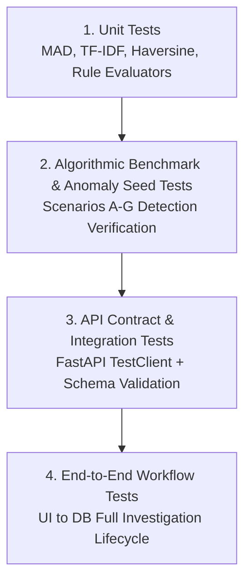

# Test Strategy & Quality Assurance Plan

## Project Details
- **Problem Statement ID:** 26102
- **Title:** Development of an AI-powered system to detect anomalies, fraud, and inefficiencies in MPLAD Scheme implementation
- **Platform:** MPLADS Risk Intelligence & Investigation Platform (RIIP)

---

## 1. Quality Assurance Philosophy & Testing Pyramid

In high-stakes public financial analytics, algorithmic errors or false alarms erode institutional trust. Our test strategy establishes automated verification across four tiers:



---

## 2. Unit Testing Suite (`tests/backend/`)

### 2.1 Statistical & Mathematical Primitives
- **Modified Z-Score Invariance:** Assert that $M_i = 0$ when $x_i = \text{median}$, and that outliers do not skew the median or MAD in skewed distributions.
- **IQR Fence Calculation:** Test boundary condition behavior on small sample sizes ($N < 5$) with fallback to categorical default bands.
- **Herfindahl-Hirschman Index (HHI):** Verify that perfectly equal distribution among $N$ vendors yields $\text{HHI} = \frac{10000}{N}$, and total monopoly yields $\text{HHI} = 10,000$.

### 2.2 Text & Geospatial Primitives
- **TF-IDF & Cosine Similarity:** Test sensitivity against abbreviation expansions ("PCC Road" vs "Plain Cement Concrete Pathway"), typo injections, and word order perturbations. Assert similarity $> 0.85$ for paraphrased descriptions.
- **Haversine Distance Function:** Test against known geographic benchmarks (e.g. distance between Port Blair Juvenile Home and Nayagaon Junction $\approx 350\text{m}$).

### 2.3 Domain Rule Evaluators
- **Statutory 365-Day Rule:** Assert that works with $(\text{Today} - \text{SanctionDate}) = 366$ days and `status != 'Completed'` trigger the stall penalty.
- **Tender Threshold Splitting:** Assert that 3 works sanctioned at ₹9.9L in the same block within 14 days trigger Rule 1.2, whereas 3 works sanctioned at ₹2.0L or separated by 120 days do not.
- **Trust and Society Ceiling:** Assert that an MP allocating ₹80L across 3 trust projects triggers the statutory cap breach flag on the third work.

---

## 3. Algorithmic Benchmark Tests (Seeded Scenarios A–G)

The test suite systematically runs the hybrid engine against the benchmark dataset and asserts 100% detection of all 7 seeded anomaly archetypes:

| Scenario | Target Anomaly Archetype | Assertion Target | Expected Severity |
| :--- | :--- | :--- | :--- |
| **A** | Tender Threshold Splitting | `has_trigger('THRESHOLD_SPLIT') == True` | `HIGH` / `CRITICAL` |
| **B** | Near-Duplicate Asset Creation | `has_trigger('NEAR_DUPLICATE_PROXIMITY') == True` | `HIGH` |
| **C** | Unit Cost Outlier | `baseline_metrics['z_score'] > 3.5` | `HIGH` / `CRITICAL` |
| **D** | Front-Loaded Advance Overpayment| `observed_gap > 50.0%` | `HIGH` |
| **E** | Chronic 365-Day Stall | `days_elapsed > 365 and penalty > 0` | `HIGH` |
| **F** | Single-Vendor Monopolization | `hhi_index > 2500` | `HIGH` |
| **G** | Statutory Cap Breach (Trusts) | `cumulative_allocation > 7500000.0` | `CRITICAL` |

### False Discovery Rate Benchmark:
- The suite evaluates the 472 unseeded baseline works and asserts that **less than 4.0%** are flagged as `HIGH` or `CRITICAL` risk, confirming calibration against excessive false positives.

---

## 4. API Contract & Integration Tests

Using FastAPI `TestClient` and `pytest`:
- **`test_dashboard_summary()`**: Asserts that `total_works == works_sanctioned + works_recommended_unsanctioned`, and that the response matches `DashboardSummaryDTO` schema.
- **`test_anomalies_pagination_and_sorting()`**: Validates that sorting by `composite_risk_score` descending returns strictly monotonically decreasing values.
- **`test_explainability_dossier_contract()`**: Asserts that for any flagged work, the returned dossier contains:
  - Non-empty `trigger_factors` array.
  - Valid `baseline_comparison` with numerical `p25`, `median`, `p75`, `p95`.
  - Non-empty `verification_checklist` with step-by-step guidance.
- **`test_investigation_state_machine()`**: Validates valid state transitions (`UNREVIEWED` $\to$ `IN_REVIEW` $\to$ `INSPECTION_PENDING` $\to$ `RESOLVED`). Asserts that an invalid transition (e.g. direct leap from `RESOLVED` to `UNREVIEWED` without authorization) raises HTTP 400.
- **`test_immutable_audit_logging()`**: Verifies that every `POST /investigations/{work_id}/review` automatically creates an immutable audit row with correct before/after states.

---

## 5. Frontend & UI Verification Tests

- **Component Mount Testing:**
  - Verify that `OverviewDashboard` renders all 4 KPI cards and chart canvases without console warnings.
  - Verify that clicking a row in `RiskExplorer` renders the `ExplainabilityDossier` slide-over drawer within 50ms.
  - Verify that the `[REAL eSAKSHI]` vs `[DEMO BENCHMARK]` badge reacts instantly to state changes.
- **Interactive Review Flow:**
  - Simulate reviewer note entry, status selection, and button submission; assert optimistic table update.

---

## 6. Execution Commands & Automation

```bash
# 1. Run all backend unit and algorithmic tests with coverage
pytest tests/backend/ -v --cov=backend/app --cov-report=term-missing

# 2. Run specific scenario benchmark test
pytest tests/backend/test_risk_engine.py -k "test_scenario_a_splitting"

# 3. Run API integration tests
pytest tests/backend/test_api_endpoints.py

# 4. Run frontend test suite
cd frontend && npm test -- --run
```
